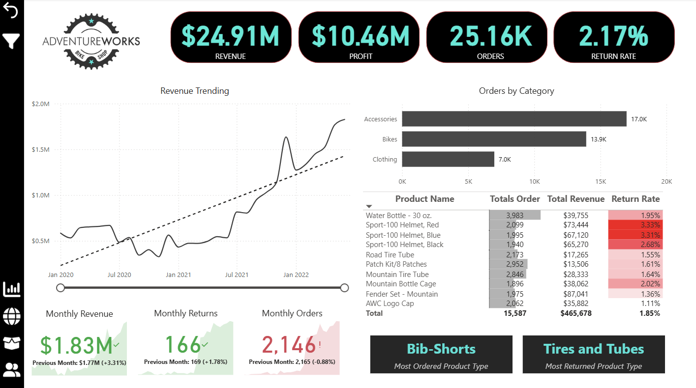
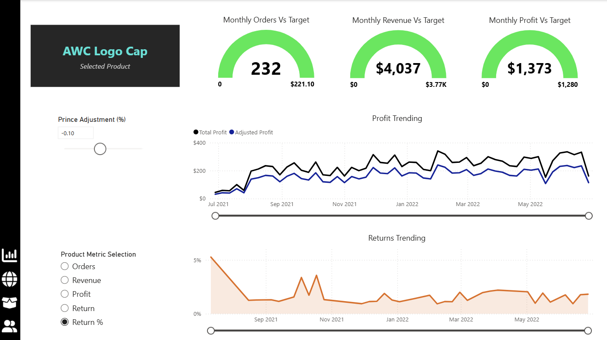
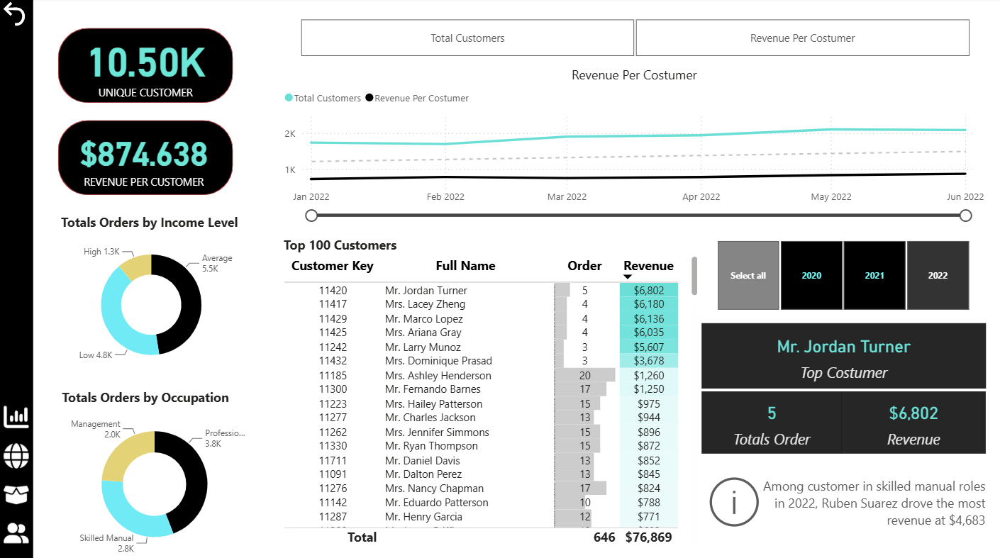

# 🛒 Maven Market — Retail Performance Analytics

Interactive Power BI project designed to analyze retail sales, profitability, orders, returns, product performance, customer behavior, and performance against business targets.

## 📊 Project Overview

This project analyzes retail performance through an interactive Power BI solution that combines sales, returns, product, customer, and geographic data.

The dashboard enables users to monitor key business indicators, analyze performance trends, compare actual results against targets, evaluate product performance, and explore customer behavior.

## 🎯 Business Questions

The analysis was designed to answer questions such as:

- How are revenue, profit, orders, and returns performing?
- How is monthly performance changing over time?
- Which product categories and individual products drive the most orders and revenue?
- Which products have the highest return rates?
- How is actual performance tracking against business targets?
- How could changes in product pricing affect profitability?
- Which customer segments generate the most orders and revenue?
- Who are the highest-value customers?

## 🛠️ Tools & Skills

- **Power BI** — Dashboard development and interactive data visualization
- **Power Query** — Data cleaning and transformation
- **DAX** — Measures, KPIs, targets, and analytical calculations
- **Data Modeling** — Relationships across sales, returns, product, customer, calendar, and territory data
- **What-If Analysis** — Price adjustment scenario analysis
- **KPI Analysis** — Monitoring revenue, profit, orders, returns, and performance against targets
- **Customer Analytics** — Customer segmentation and performance analysis

## 🗂️ Data Model

The analytical model integrates multiple business datasets, including:

- Sales transactions
- Product information
- Product categories and subcategories
- Customer information
- Returns
- Calendar data
- Geographic territories

Relationships between fact and dimension tables support interactive analysis across products, customers, time periods, and geographic markets.

## 📈 Dashboard Analysis

### Executive Dashboard

The executive view provides a consolidated overview of:

- Revenue
- Profit
- Orders
- Return Rate
- Revenue trends
- Orders by product category
- Product-level revenue and return performance
- Monthly revenue, returns, and orders

### Product Performance & Scenario Analysis

This view compares monthly orders, revenue, and profit against targets and enables scenario analysis through a price adjustment parameter.

The report allows users to compare actual profit with adjusted profit and dynamically analyze different product metrics.

### Customer Analysis

The customer analytics view explores:

- Unique customers
- Revenue per customer
- Customer trends over time
- Orders by income level
- Orders by occupation
- Top customers by revenue
- Customer performance across different time periods

## 💡 Key Insights

- Total revenue reached **$24.91M**, generating **$10.46M in profit**.
- The business recorded approximately **25.16K orders** with an overall **2.17% return rate**.
- Accessories generated the highest number of orders among the major product categories shown in the executive dashboard.
- Product-level analysis reveals meaningful differences in return rates across products.
- Customer segmentation provides additional visibility into purchasing behavior across income levels and occupations.
- Scenario analysis allows users to evaluate how price adjustments could affect product profitability.

## 📁 Project File

The complete Power BI report is available in this repository:

`Maven-Market-Retail-Analytics.pbix`

## 👤 Author

**Juan Alejandro Bencosme Diaz**  
Data Analyst | Power BI | Python | Data Visualization
